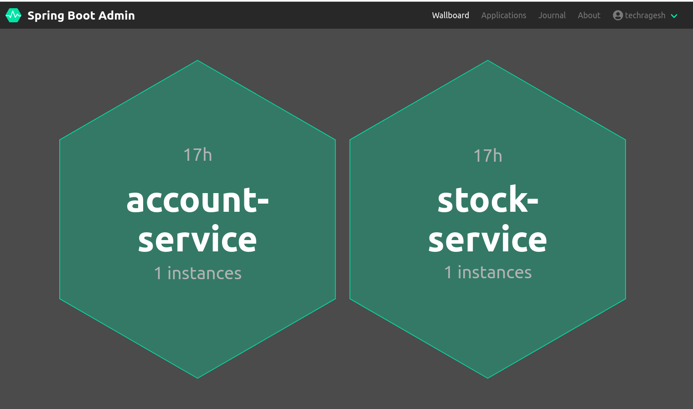
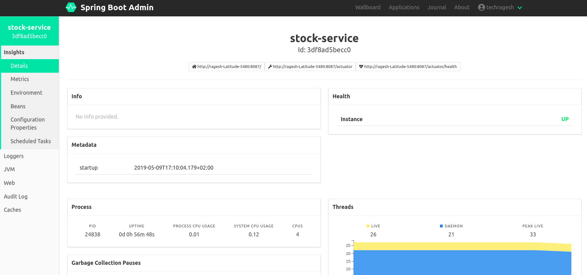
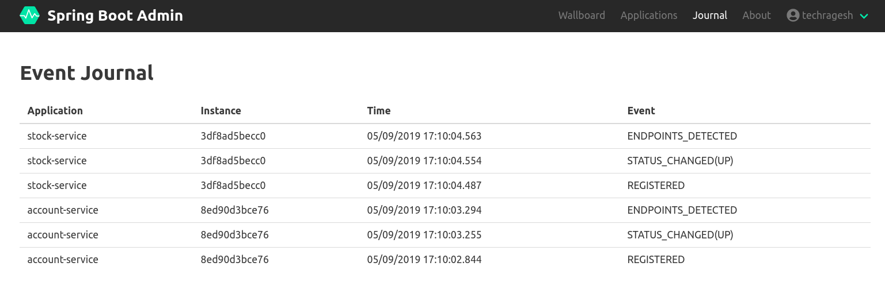

# springboot-admin-demo
This project explains how to use springboot admin in microservice applications

### springboot admin

To monitor and manage your spring boot application with a beautiful UI on top of Spring Boot Actuator.

Spring Boot Admin is not a core module provided by Spring Team. It was created by a company called codecentric.

It actually comes in two parts.

* **Server** 
* **Client**

**_Server_:**

It contains admin user interface and runs independent from the monitored applications. If your application is down, the monitoring server is still up and running. 
With the spring boot admin, each instance of your monitored application (client) registers with the server after it starts.

**_Client_:**

Client part is in the monitored application, which registers with the Admin Server part.

### springboot actuator

Actuator is a Spring Boot module, which adds REST and JMX endpoints to your application, so you can easily monitor and manage it in production. The endpoints offer health-check, metrics monitoring, access to logs, thread dumps, heap dumps, environmental info and more.

### Applications

I have created 3 application. Assume Account Service and Stock Service are look like microservice applications and appadmin is a spring boot admin application.

### Server Setup

_**Maven Dependencides:**_

```
<dependency>
    <groupId>de.codecentric</groupId>
	<artifactId>spring-boot-admin-starter-server</artifactId>
</dependency>

<dependency>
	<groupId>org.springframework.boot</groupId>
	<artifactId>spring-boot-starter-security</artifactId>
</dependency>

```
**Note**: if you want to add spring security for spring admin server. Just add spring boot secuity dependency otherwise not required.

_**application.properties**_

```
spring.application.name=springboot-admin
server.port=8085
spring.security.user.name=techragesh
spring.security.user.password=admintech

```

Add **@EnableAdminServer** in the Main Class.

```
@SpringBootApplication
@EnableAdminServer
public class AppadminApplication {

	public static void main(String[] args) {
		SpringApplication.run(AppadminApplication.class, args);
	}

}

```

Add Spring Security configuration

```
@Configuration
public class SecurityConfig extends WebSecurityConfigurerAdapter {

    @Override
    protected void configure(HttpSecurity http) throws Exception {
        SavedRequestAwareAuthenticationSuccessHandler successHandler
                = new SavedRequestAwareAuthenticationSuccessHandler();
        successHandler.setTargetUrlParameter("redirectTo");
        successHandler.setDefaultTargetUrl("/");

        http.authorizeRequests()
                .antMatchers("/assets/**").permitAll()
                .antMatchers("/login").permitAll()
                .anyRequest().authenticated().and()
                .formLogin().loginPage("/login")
                .successHandler(successHandler).and()
                .logout().logoutUrl("/logout").and()
                .httpBasic().and()
                .csrf()
                .csrfTokenRepository(CookieCsrfTokenRepository.withHttpOnlyFalse())
                .ignoringAntMatchers(
                        "/instances",
                        "/actuator/**"
                );
    }
}

```

### Client Setup

_**Maven Dependencides:**_

```
<dependency>
    <groupId>de.codecentric</groupId>
	<artifactId>spring-boot-admin-starter-client</artifactId>
</dependency>

<dependency>
	<groupId>org.springframework.boot</groupId>
	<artifactId>spring-boot-starter-actuator</artifactId>
</dependency>

```

_**application.properties**_

```
spring.boot.admin.client.url=http://localhost:8085
server.port=8087
spring.application.name=stock-service
management.endpoints.web.exposure.include=*
spring.boot.admin.client.username=techragesh
spring.boot.admin.client.password=admintech

```

### Endpoints

Spring Boot Admin App: http://localhost:8085

Account-Service App: http://localhost:8086

Stock-Service App: http://localhost:8087


### Screenshots









### Happy Coding